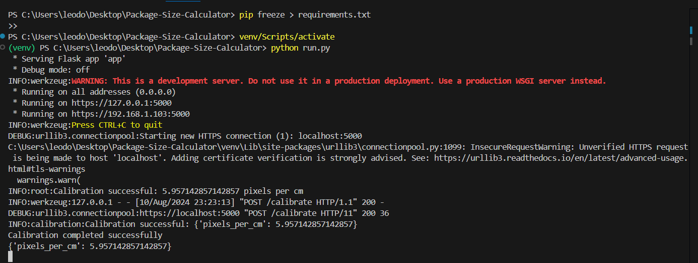
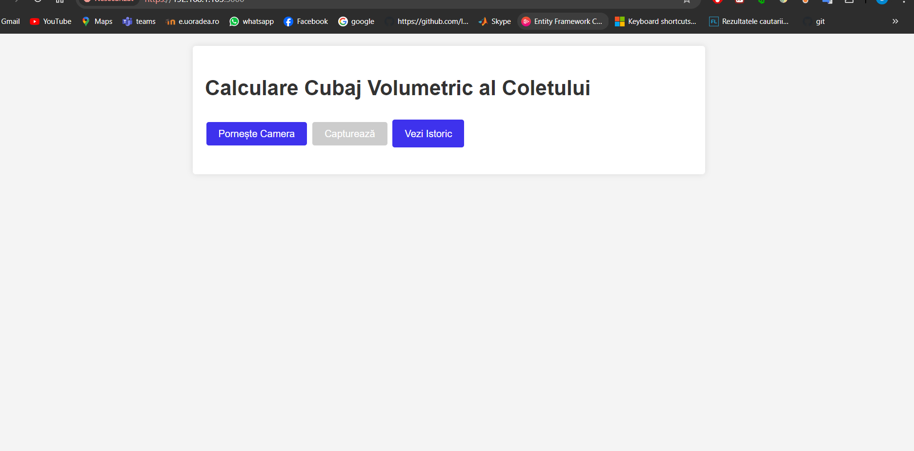

Editor code am folosit VS Code , este posibil si alt editor de cod
1. Pentru baza de date am folosit Workbench, In config.py din directorul proiectului , vor trebui setate credentialele pentru instanta locala , dupa care generarea bazei de date si a tabelei, in editorul pentru baza de date:
    - CREATE DATABASE cube_calculator;
    - USE cube_calculator; // pentru a selecta baza de date daca se doresc modificari sau vizualizari 
    - tabela ar trebui sa se creeze la pornirea programului
2. Pentru a folosi toate pachetele necesare rularii acestui program vom intra in environment cu comenzile 
    1. pentru macOS: 
    - python3 -m venv venv(pentru a crea un environment ) 
    - source venv/bin/activate pentru a intra in venv
    - pip install -r requirements.txt pentru a instala toate pachetele, important ca cmd sa fie in aceasi locatie cu acest file
    - python3 (sau python) run.py
    2. Pentru Windows, exista deja un venv creat:
    - venv/Scripts/activate pentru a intra in environment
    - python3 (sau python) run.py 
Orice problema aparuta la deschidere pachetelor se va sterge sau se va crea un nou environment si se vor instal pachetele 
3. 
    - vom vedea aceste loguri , programul va rula pe server local conform ceritelor , proiectu are deja implementat un script pentru a detecta ip-ul local al serverului pe care ruleaza, 
    - in cazul meu " * Running on https://192.168.1.103:5000" voi folosi " https://192.168.1.103:5000" pentru a deschide proiectul intr-un browser, 
    - pentru telefon aceeasi adresa, doar in cazul in care telefonul se afla intr-o retea comuna cu serverul pe care ruleaza proiectul
4. Asa va arata pe browser pornirea aplicatiei: 
5. Pentru a opri proiectul "CTRL+C" de 2 ori este nevoie in cazul meu